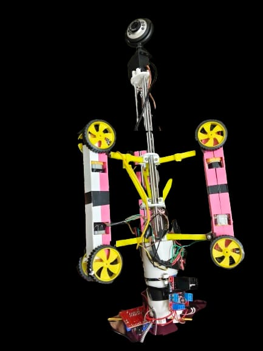

# AI-Powered Crack Detection Bot 

This project is an automated system designed for real-time structural health monitoring. It utilizes a custom-trained **YOLOv4-Tiny** model, **OpenCV**, and a **Flask-based Web Dashboard** to detect and log structural cracks. The bot integrates with an **Arduino Nano** and use a encoder and servo motor for distance sensing, angle finding and automatically captures screenshots and logs metadata (confidence, distance, timestamp) to a database for structural analysis.

---

## Media

### Hardware Implementation
 

### Demo Video
[![Watch the Demo]](https://drive.google.com/drive/folders/1DN3PEBhpMo1bafpQXgox4Qj_oxUjcs-I?usp=sharing)

---

## Project Structure

```text
Crack-Detection-Bot/
├── assets/                  # Media assets (images, GIFs, videos)
├── models/                  # YOLO weight files (stored locally or via LFS)
│   └── yolov4-tiny-custom_final.weights
│   └── data.yaml
│   └── data.names
│   └── yolov4-tiny-custom_best.weights
│   └── yolov4-tiny-custom_last.weights
├── src/                     # Source code files
│   ├── crack_detection_app.py # Main Flask application
│   └── Test_model.py        # Standalone detection script
├── templates/               # Web front-end HTML templates
│   └── index.html
├── LICENSE                  # MIT License
├── README.md                # Project documentation
└── requirements.txt         # Python dependencies
```

## System Requirements
```text
Prerequisites
OS: Windows 10/11 or Ubuntu 20.04+
Python: 3.8+
Webcam: An external USB webcam (preferred) or integrated camera.
Arduino Nano: For real-time distance sensor data integration (Optional for basic detection).
TT Encoder motor: For distance measuring
MG995 Servo motor: for 360 deg rotation of camera and getting the angle.  
```

## Install Dependencies
```text
pip install -r requirements.txt
```
```text
Usage Guide
Simulation Mode (Web Dashboard)
To launch the Flask web application and detection engine:

python src/crack_detection_app.py

Access the live feed and stats at http://localhost:5000.
Standalone Model Testing
To run the crack detection model without the web interface (output shown in OpenCV window):

python src/Test_model.py
```

📄 License
This project is licensed under the MIT License.